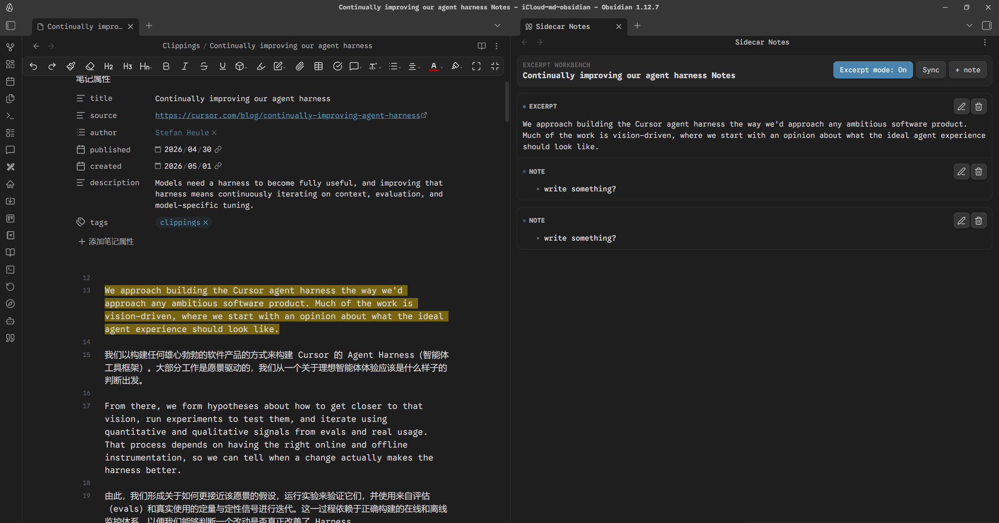
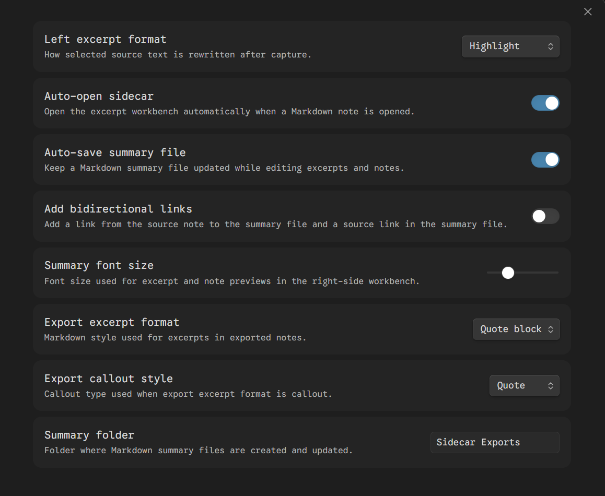

# Sidecar Notes

English | [中文](./README.zh.md)

Read on the left. Capture on the right.

Sidecar Notes is an Obsidian desktop plugin for excerpt-based reading notes. It gives you a dedicated workbench on the right side, so you can keep reading in the source note while collecting quotes, comments, and side notes without turning the workflow into a rigid template.

## Overview

Sidecar Notes is built for a simple loop:

1. Open a Markdown note.
2. Open Sidecar Notes.
3. Select text on the left.
4. Review and annotate excerpts on the right.
5. Sync everything into a Markdown note when you want.

## Screenshots





## Quick Start

1. Open a Markdown note in Obsidian.
2. Run `Sidecar Notes: Toggle excerpt workbench` or click the ribbon icon.
3. Keep `Excerpt mode: On` in the right-side workbench.
4. Select text in the source note.
5. The selected text is captured as an excerpt card on the right.
6. Search, sort, annotate, or click an excerpt card to return to the source text.
7. Click `Sync` when you want to update the exported Markdown note immediately.

## What It Does

- Keeps reading and excerpting in a split workflow instead of forcing everything into one editor.
- Captures selected text into a right-side excerpt workbench.
- Lets you choose how the source text is marked: `highlight`, `bold`, `italic`, or `none`.
- Lets you search excerpts and notes in the current workbench.
- Shows capture time for excerpt and note cards, with newest/oldest sorting.
- Lets you click an excerpt card to jump back to the matching source text.
- Supports notes attached to each excerpt.
- Supports standalone notes that are not tied to a quote.
- Renders excerpt content and notes as Markdown.
- Supports long-excerpt expand/collapse in the workbench.
- Syncs the workbench into a Markdown note automatically or on demand.
- Can export excerpts as quote blocks or Obsidian callouts.
- Can add bidirectional links between the source note and the exported note.

## Settings

- `Left excerpt format`
  Controls how selected source text is marked after capture.
- `Summary font size`
  Adjusts the preview text size in the right-side workbench.
- `Auto-open sidecar`
  Automatically opens the workbench when you open a Markdown note.
- `Auto-save summary file`
  Keeps the exported Markdown note updated while you edit excerpts and notes.
- `Add bidirectional links`
  Adds a link from the source note to the exported note and a source link in the exported note.
- `Export excerpt format`
  Chooses whether excerpts are written as quote blocks or callouts.
- `Export callout style`
  Chooses the Obsidian callout type when callout export is enabled.
- `Summary folder`
  Sets the folder where exported Markdown notes are created. Use `/` for nested folders, such as `Sidecar Exports/Books`.

## Exported Note

When auto-save is enabled, Sidecar Notes creates or updates a note like this:

```text
Sidecar Exports/{source note name} Notes.md
```

Workbench state is also stored in plugin data, so excerpts and notes can be restored when you reopen the same source note.

## Good Fit

Sidecar Notes works best if you want to:

- read and excerpt in parallel
- collect quotes while keeping short commentary nearby
- build reading notes without forcing a fixed template
- export a clean Markdown note after reviewing your excerpts

It is not trying to be:

- an automatic summarizer
- a rigid reading-note template
- a full writing system built around predefined sections

## Manual Installation

Copy these files into:

```text
<vault>/.obsidian/plugins/sidecar-notes/
```

Required files:

- `main.js`
- `manifest.json`
- `styles.css`
- `versions.json`

Reload Obsidian and enable `Sidecar Notes`.

## Development

```bash
npm install
npm run build
```

For watch mode:

```bash
npm run dev
```

## Release Files

Upload these files for each GitHub release:

- `main.js`
- `manifest.json`
- `styles.css`
- `versions.json`
